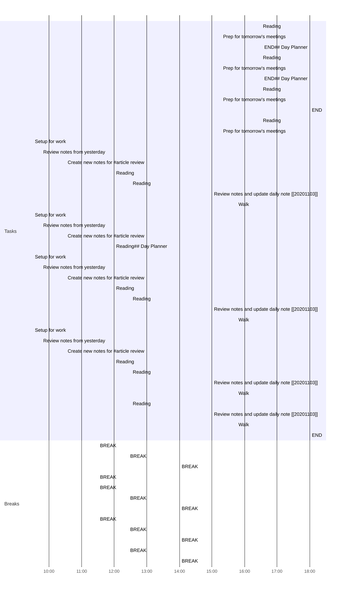

## Day Planner

### Morning Prep

This is where I get ready for work and do my usual prep.

### Reading

A section of the day dedicated to reading:

1. Articles.
2. Book chapters assigned for the day.
3. Re-reading past notes.
   
  - [ ] Article 1
  - [ ] Article 2
  - [ ] Article notes review

### Afternoon Review

I use this time to review what I have done earlier in the day and complete any tasks to prepare for the next day.

- [ ] 16:30 Reading
- [ ] 17:20 Prep for tomorrow's meetings
- [ ] 18:00 END## Day Planner

### Morning Prep

This is where I get ready for work and do my usual prep.

### Reading

A section of the day dedicated to reading:

1. Articles.
2. Book chapters assigned for the day.
3. Re-reading past notes.
   

### Morning Prep

This is where I get ready for work and do my usual prep.

### Reading

A section of the day dedicated to reading:

1. Articles.
2. Book chapters assigned for the day.
3. Re-reading past notes.
   
  - [ ] Article 1
  - [ ] Article 2
  - [ ] Article notes review

### Afternoon Review

I use this time to review what I have done earlier in the day and complete any tasks to prepare for the next day.

- [ ] 16:30 Reading
- [ ] 17:20 Prep for tomorrow's meetings
- [ ] 18:00 END## Day Planner

### Morning Prep

This is where I get ready for work and do my usual prep.

### Reading

A section of the day dedicated to reading:

1. Articles.
2. Book chapters assigned for the day.
3. Re-reading past notes.
   
  - [ ] Article 1
  - [ ] Article 2
  - [ ] Article notes review

### Afternoon Review

I use this time to review what I have done earlier in the day and complete any tasks to prepare for the next day.

- [ ] 16:30 Reading
- [ ] 17:20 Prep for tomorrow's meetings
- [ ] 18:00 END
  - [ ] Article 1
  - [ ] Article 2
  - [ ] Article notes review

### Afternoon Review

I use this time to review what I have done earlier in the day and complete any tasks to prepare for the next day.

- [ ] 16:30 Reading
- [ ] 17:20 Prep for tomorrow's meetings
## Completed
- [x] 09:30 Setup for work
- [x] 09:45 Review notes from yesterday
- [x] 10:30 Create new notes for #article review
- [x] 11:30 BREAK
- [x] 12:00 Reading
- [x] 12:25 BREAK
- [x] 12:30 Reading
- [x] 14:00 BREAK
- [x] 15:00 Review notes and update daily note [[20201103]]
- [x] 15:45 Walk
- [x] 09:30 Setup for work
- [x] 09:45 Review notes from yesterday
- [x] 10:30 Create new notes for #article review
- [x] 11:30 BREAK
- [x] 12:00 Reading## Day Planner
- [x] 09:30 Setup for work
- [x] 09:45 Review notes from yesterday
- [x] 10:30 Create new notes for #article review
- [x] 11:30 BREAK
- [x] 12:00 Reading
- [x] 12:25 BREAK
- [x] 12:30 Reading
- [x] 14:00 BREAK
- [x] 15:00 Review notes and update daily note [[20201103]]
- [x] 15:45 Walk
- [x] 09:30 Setup for work
- [x] 09:45 Review notes from yesterday
- [x] 10:30 Create new notes for #article review
- [x] 11:30 BREAK
- [x] 12:00 Reading
- [x] 12:25 BREAK
- [x] 12:30 Reading
- [x] 14:00 BREAK
- [x] 15:00 Review notes and update daily note [[20201103]]
- [x] 15:45 Walk
- [x] 12:25 BREAK
- [x] 12:30 Reading
- [x] 14:00 BREAK
- [x] 15:00 Review notes and update daily note [[20201103]]
- [ ] 15:45 Walk
- [ ] 18:00 END