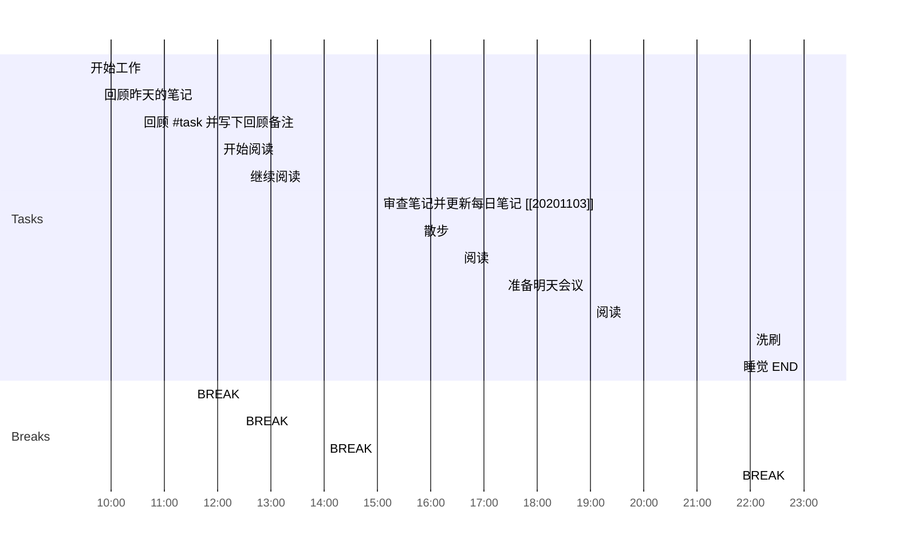

## 日程安排
今天计划
1. 早晨准备
2. 阅读
3. 下午复习

### 早晨准备

This is where I get ready for work and do my usual prep.

- [x] 09:30 开始工作
- [x] 09:45 回顾昨天的笔记
- [x] 10:30 回顾 #task 并写下回顾备注
- [x] 11:30 BREAK

### 阅读

今天的阅读任务:

1. 两篇博客文章.
2. 要读完微信力量第4-3章节。
3. 回顾以前的阅读笔记。
   
- [x] 12:00 开始阅读
  - [x] 最没有存在感的城市s宁夏
  - [x] 一篇技术博客
  - [x] 回顾博客笔记
- [x] 12:25 BREAK
- [x] 12:30 继续阅读
- [x] 14:00 BREAK

### 午评
我使用这次回顾一下我当天早些时候所做的事情，并完成所有工作，为第二天做准备。

- [x] 15:00 审查笔记并更新每日笔记 [[20210103]]
- [x] 15:45 散步
- [x] 16:30 阅读
- [x] 17:20 准备明天会议
- [x] 19:00 阅读
	- [ ] 阅读精英习惯
	- [ ] 20:00 阅读微信的力量
	- [ ] 21:00 阅读大秦帝国
- [x] 21:45 BREAK
- [x] 22:00 洗刷
- [x] 23:00 睡觉 END